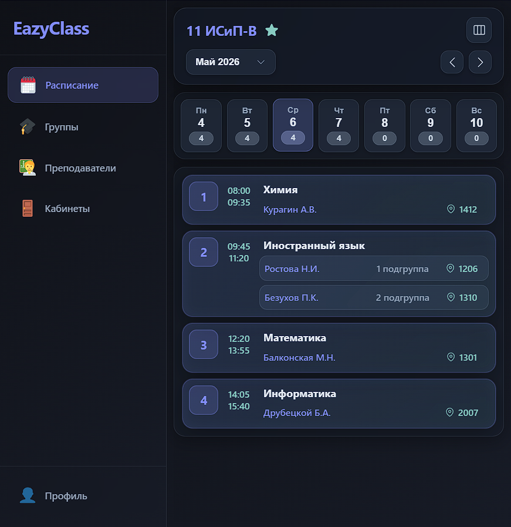
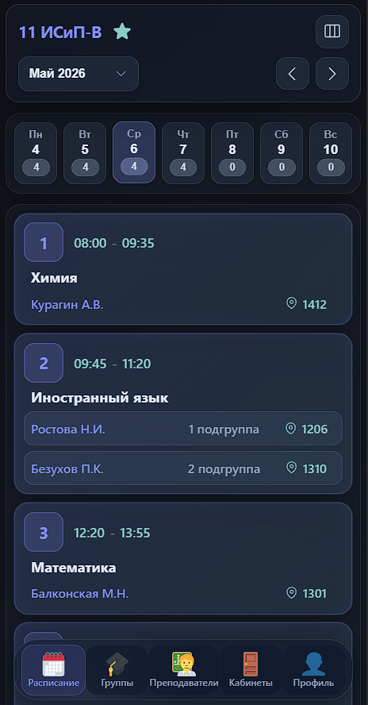

# EazyWeb — просмотр расписаний

EazyWeb — одностраничное веб-приложение для удобного просмотра учебного расписания: расписаний групп, преподавателей и аудиторий. Подходит для студентов и сотрудников, которым нужно быстро увидеть текущие и предстоящие занятия в дневном или недельном виде.

**Коротко:** 
- интерфейс на Vue 3 + Vite, 
- общение с сервером через Axios (файлы в [src/api](src/api)), 
- поддержка авторизации через Telegram (deeplink).

### Возможности
- Просмотр расписания по группе, преподавателю или аудитории
- Дневной и недельный режимы отображения
- Подробная карточка занятия с информацией о предмете, преподавателе и аудитории
- Управление уведомлениями
- Простая авторизация через Telegram (при наличии бэкенда)

### Технологии
- `Vue 3` + `Vite`
- `Axios` для общения с API (сервисные модули в `src/api`)
- Простая компонентная структура в `src/components` и страницы в `src/views`
---

### Скриншоты
<table>
  <tr>
    <td align="center">
      <br>
      <sub>Desktop</sub>
    </td>
    <td align="center">
      <br>
      <sub>Mobile</sub>
    </td>
  </tr>
</table>

---

### 🔗 Связанные проекты

Этот репозиторий — часть общей системы:

Backend (Django):  
https://github.com/moiseev-anton/EazyClass  

Telegram-бот (авторизация и уведомления):  
https://github.com/moiseev-anton/EazyBot

 Вместе они реализуют:
- хранение и управление расписанием
- подписки пользователей
- рассылка уведомления (Celery)
- доставку уведомлений через Telegram
---

### Быстрый старт
1. Установите зависимости:

```
pnpm install
```

2. Запуск в режиме разработки:

```
pnpm dev
```

3. Сборка для продакшена:

```
pnpm build
pnpm preview
```

(Если вы используете `npm` или `yarn`, замените команды соответствующим образом.)

**Конфигурация**  

Базовый URL API и другие настройки находятся в [src/api/axios.js](src/api/axios.js). Измените при необходимости, чтобы подключиться к вашему бэкенду.

---

#### Структура проекта
- `src/components` — переиспользуемые Vue-компоненты (карточки занятий, навигация и т.д.)
- `src/views` — страницы приложения (расписание, преподаватели, аудитории, профиль)
- `src/api` — модули для работы с API (`axios.js`, сервисы для групп, преподавателей и т.д.)
---

#### Вклад и поддержка
- Пулреквесты и отчёты об ошибках приветствуются.
- Для настройки бэкенда или вопросов по интеграции напишите автору проекта.

